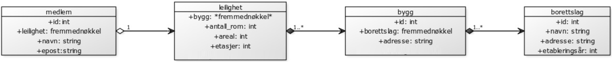

## **Øving1**
# Relasjonsmodellen, del 1
Her er database oppgavene om boligbyggerlaget Bygg & Bo.  

## a)
> Unngå også å lagre data som kan avledes av andre data.


Inkluderte derfor ikke antall bygg i borettslag og antal leligheter i bygg fordi disse kan avledes gjennom å telle hvor mange bygg/leiligheter som referer tabellen.




## b)


## c)
```sql
CREATE TABLE `bygg_og_bo`.`borettslag` (
    `id` INT NOT NULL AUTO_INCREMENT ,
    `navn` VARCHAR(300) NOT NULL ,
    `adresse` VARCHAR(300) NOT NULL ,
    `etableringsår` INT NOT NULL ,
    PRIMARY KEY (`id`)
    ) 
```

```sql
CREATE TABLE `bygg_og_bo`.`bygg` ( 
    `id` INT NOT NULL AUTO_INCREMENT , 
    `borettslag` INT NOT NULL , 
    `adresse` VARCHAR(300) NOT NULL , 
    PRIMARY KEY (`id`), 
    INDEX `id` (`borettslag`)
    ) 
```

```sql
CREATE TABLE `bygg_og_bo`.`leilighet` ( 
    `id` INT NOT NULL AUTO_INCREMENT , 
    `bygg` INT NOT NULL , 
    `antall_rom` INT NOT NULL , 
    `areal` INT NOT NULL , 
    `etasjer` INT NOT NULL DEFAULT '1' , 
    `leilighetsnummer` INT NOT NULL DEFAULT '1' , 
    PRIMARY KEY (`id`), 
    INDEX `id` (`bygg`)
    )
```

```sql
CREATE TABLE `bygg_og_bo`.`medlem` ( 
    `id` INT NOT NULL AUTO_INCREMENT , 
    `leilighet` INT NOT NULL , 
    `navn` VARCHAR(300) NOT NULL , 
    `epost` VARCHAR(350) NOT NULL , 
    PRIMARY KEY (`id`), 
    INDEX `id` (`leilighet`)
    ) 
```

## d)

### Leilighet tabell:

| id | bygg | antall_rom | areal | etasjer | leilighetsnummer |
|----|------|------------|-------|---------|------------------|
| 1  | 2    | 9          | 137   | 3       | 1                |
| 2  | 1    | 5          | 96    | 1       | 1                |
| 3  | 1    | 5          | 97    | 1       | 2                |

### Medlem tabell:

| id | leilighet | navn          | epost                |
|----|-----------|---------------|----------------------|
| 1  | 2         | Ola Nordmann  | OlaNord@gmail.com    |
| 2  | 3         | Bigga Borsann | BiBoHiii@hotmail.com |

### Gyldig `INSERT` setning:

```sql
INSERT INTO `medlem`(`leilighet`, `navn`, `epost`) VALUES (1, "Brason Manson", "altbra@ntnu.no")
```

### Dårlig referanse `INSERT` setning:

```sql
INSERT INTO `medlem`(`leilighet`, `navn`, `epost`) VALUES (9, "Feilu Torsu", "neinei@bad.no")
```

Dette er fordi det ikke finnes noe leilighet med id på 9 og vi får derfor et brudd på entitets- og referanseintegritetsreglene.


## e)
Når det kommer til at fremmednøkler kan være NULL får vi fra oppgaven at
> Det er mulig å være medlem i et borettslag uten å eie en leilighet der  

Fra dette kan vi se for oss at fremmednøkkelen til et medlem som peker til en leilighet burde kunne være NULL

## f)
I min implementasjon så brukte jeg et auto increment tall som id, hvis man brukte en annen implementasjon (som kombinasjon av adresse og navn) kunne update cascade vært nødvendig på flere steder, med det unnagjort kan vi se på vært tilfelle om vi burde bruke `ON DELETE`/`UPDATE CASCADE`


### Medlem
Har en fremmednøkkel til leilighet. Hvis leiligheten rives eller brenner ned er det *ikke* logisk å måtte slette medlemmer fra registeret. Fordi fremmednøkkelen peker til en id som ikke forandres blir det også lite mening å implementere noe update cascade.


### Leilighet
Har en fremmednøkkel til bygg. Hvis vi ser for oss den samme situasjonen med et bygg som rives/brennes ned er det da helt logisk at alle leilighetene i det bygget også forsvinner. Så i dette tilfellet kan vi se for oss at `ON DELETE` kunne vært smart å implementere.

### Bygg
Har en fremmednøkkel til borettslag. Vi kan se for oss at et borettslag deles i to eller blir kombinert og da vil byggene forsatt eksistere, derfor blir det lite mening å implementere on delete. Pekes også til en konstant id så update cascade trengs heller ikke.

