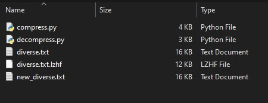

### Øving 7
# Komprimering
Dette er komprimeringsalgoritmen som implementerer Lempel-Ziv og Huffman koding og lagrer til en fil med format `.lzhf`


## Skjermdump
Filstørrelser for originalfil, komprimert fil og utpakket fil:



## Video av kode i bruk
Jeg tok et lite opptak av terminalen hvor jeg komprimerer 'diverse.txt' til 'diverse.txt.lzhf' med 25.5% reduksjon i størrelse, deretter dekomprimerer jeg filen og bruker fc for å vise at den dekomprimerte filen er identisk til orginalen.

[](https://www.youtube.com/watch?v=SwKN6W9s-s0)  
*(Klikk på bilde for å bli sent til YouTube)*

-----

## Kildekode
Her er python filen for compress og decompress og syntax for å kjøre dem henholdsvis:  


- ### [compress.py](./compress.py)  
    `python ./compress.py %FILE_PATH%`  
-----
- ### [decompress.py](./decompress.py)
    `python ./decompress.py %FILE_PATH%`

## Lempel-Ziv

Denne algoritmen jobber bare med bytes og var derfor relativt enkelt å implementere. Valgte å bruke en byte for referanser som betyr at referansene blir korte, men jeg hadde allerede ytelsesproblemer med python så klager ikke.

```python
def lz_compress(byte_array):
    MAX_SIZE = 255
    codebook = [[] for i in range(MAX_SIZE)]
    last_index = MAX_SIZE
    result = bytearray()

    current_matches = bytearray()

    for b in byte_array:
        
        try:
            # find refrence matching current block
            last_index = codebook.index([*current_matches,b])

        except ValueError:

            # add new block for future refrences and remove first element to keep size constant
            codebook.append([*current_matches,b])
            codebook.pop(0)
            
            # add refrence and value to output
            result.extend(((last_index), b))

            # reset vars for next block
            last_index=MAX_SIZE
            current_matches = bytearray()

        else:
            # found match for previous refrence, continue
            current_matches.append(b)

    result.append(last_index)
    
    return result


```


```python
def lz_decompress(byte_arr):

    refrence_value_pairs = [(byte_arr[i*2], byte_arr[i*2+1]) for i in range(len(byte_arr)//2)]

    MAX_SIZE = 255
    codebook = [() for i in range(MAX_SIZE)]

    result = bytearray()

    for refrence, value in refrence_value_pairs:

        refrence_val = codebook[refrence] if refrence != MAX_SIZE else ()

        codebook.append((*refrence_val,value))
        codebook.pop(0)

        result.extend((*refrence_val, value))

    # add last item if it wasnt refrenced
    if byte_arr[-1] != MAX_SIZE: result.extend((codebook[byte_arr[-1]]))

    return result  

```
-----
## Huffman coding
Her måtte jeg 'get down in the nitty gritty' som man ville sagt, når man jobber med bits så må man forsikre at man alltid er i riktig posisjon, at variabler tar opp riktig mengde plass og at det kan gjøres om til bytes igjen til slutt.


**Filformatet er som følger:**

- De to første bytes er mengden nuller som fylles på slutten (for å kunne gjøre om til bytes) og mengden koder. 

- Kodene eller Huffman treet som alle består av 3 deler: byten som koden representerer (8 bits), lengden på koden (4 bits), og selve koden (max 16 bits).

- Dataen som består av kodene (selve Huffman algoritmen)

- Null fyll som går fra 0-7 bits for å forsikre at filen kan lagres som bytes.

Det finnes sikkert bedre måter å implementere fileformatet på, men denne fungerte for meg.

```python
from bitstring import BitArray

def hf_compress(byte_array):
    MAX_SIZE = 256

    freq_table = [0 for i in range(MAX_SIZE)]
    for b in byte_array: freq_table[b] += 1
    
    hf_tree = create_huffman_tree(freq_table)
    hf_codes = parse_tree(hf_tree)

    result = BitArray(bin_pad(len(hf_codes),8))

    # encode tree
    for k, v in hf_codes: 
        
        byte_key = bytes([k])
        result.append(byte_key)

        code_length = bin_pad(len(v),4)

        result.append(code_length)
        result.append('0b' + v)


    # encode data
    for b in byte_array:
        code = [c[1] for c in hf_codes if c[0] == b].pop()
        result.append('0b' + code)

    # find required padding to make bits go into bytes
    padding_size = 8 - len(result.bin) % 8
    result.prepend(bin_pad(padding_size,8))

    return result.tobytes()

```

```python
from bitstring import BitArray

def hf_decompress(byte_array: BitArray):

    # will need to work with bits for this function
    bit_array = BitArray(byte_array)
    
    # get constant vars from start of file
    end_padding = int(bit_array[0:8].bin ,2)
    n_codes = int(bit_array[8:16].bin ,2)

    # remove filler zeros
    bit_array = bit_array[:-1*end_padding]

    codes = []
    pos = 16

    # parse codes
    for i in range(n_codes):
        key = bit_array[pos:pos+8].bin
        c_length = int(bit_array[pos+8:pos+8+4].bin ,2)
        code = bit_array[pos+8+4:pos+8+4+c_length].bin

        codes.append((code,key))
        pos += c_length + 8 + 4

    prev_find = 0
    offset = 1
    result = bytearray()

    # build result using parsed codes
    while len(bit_array) > pos:

        selection = bit_array[pos:pos+offset].bin
        found = [c for c in codes if c[0] == selection]

        if found:
            result.append(int(found.pop()[1], 2))
            pos += offset
            offset = 1
        else:
            offset += 1

    return result
```

### Hjelpemetoder og klasse for huffman
```python
class Node:
    def __init__(self, freq, val, left=None, right=None):
        self.freq = freq
        self.val = val
        self.left = left
        self.right = right

    def __gt__(self, node_2):
        self.freq > node_2.freq

def parse_tree(tree, code=''):

    if tree.val is not None:
        return [(tree.val,code)]
    else:
        left = parse_tree(tree.left,code + '0') if tree.left is not None else ()
        right = parse_tree(tree.right,code + '1') if tree.right is not None else ()

        return [*left, *right]
        
def create_huffman_tree(freq_table: bytes):
    
    # remove bytes with no frequency and create (freq, val) tuples
    freq_tuples = [Node(freq_table[i], i) for i in range(len(freq_table)) if freq_table[i] != 0]

    while len(freq_tuples) > 1:

        freq_tuples.sort(key=lambda a: a.freq)

        # get smallest possible left and right node
        
        left = freq_tuples.pop(0)
        right = freq_tuples.pop(0)

        # sum the tuple frequency
        node_freq = left.freq + right.freq

        # combine tuple value as new branch
        # node_branch = (left[1], right[1])
        new_node = Node(node_freq, None, left, right)
        
        freq_tuples.append(new_node)
 
    return freq_tuples.pop()

# helper method binary padding for integers
def bin_pad(number, padding):
    return f'0b{bin(number)[2:]:0>{padding}}'


```


## Notater

I etterkant kan det reflekteres på klokheten av å gjøre denne oppgaven i python. Det var mulig, men følte at verktøystøtte ikke var like god i python i forhold til de forrige øvningene. 

Kompleksiteten på oppgaven begynner også å stresse svakheten av å bruke et skriptspråk. Organisasjon blir også et svaktpunkt hvor man begynner å savne et mer OOP språk som er hvorfor jeg valgte å implementere en klasse for denne øvingen.
