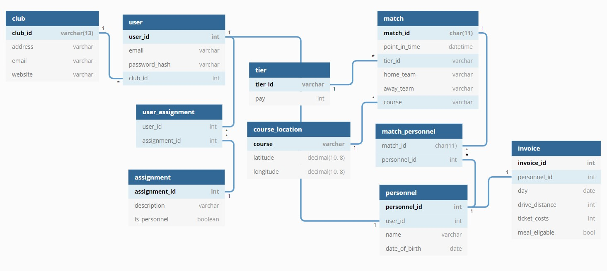

## Øving 8
# Egen databaseløsning

## Definering av behov og mål

MinDommer er en webside for lokale håndballag å håndtere fakturering av personell rundt kamper.

Det skal være en webside hvor personell kan fylle inn nødvendig informasjon og se status på betalinger, sjefer kan 
sette personell opp på kamper, og kasserer kan se regninger sent inn.

## Mål for lagring og representasjon

Vært håndballag har et navn, lagId, hjemmebane og telefonnummer.

For websiden kommer det til å være flere brukere koblet til et håndballag. 
Brukere kan ha mange forskjellige posisjoner (sjef, kasserer, dommere, trenere, dommerutviklere, osv...)
De skal kunne logge seg inn og trenger derfor epost og kryptert passord lagret.
Fordi dette er for små lokale lag er det ofte slik at brukere har flere forskjellige posisjoner samtidig så dette må kunne være mulig i systemet.

I et lag er det mange personell, dette er posisjoner som har forskjellige oppgaver rundt kamper og blir betalt for dette.
Om en bruker er av en spesefikk type posisjon (dommer, trener, osv...) er de personell.
For at de skal kunne bli betalt trengs navn og fødselsdato å være lagret (for sikkerhetsgrunner er annen privat informasjon lagret av kasserer).

Et håndballag har flere kamper, vær kamp har en kampId, kampsted, nivå, tidspunkt, bortelag og hjemmelag (string)
En kamp har flere personell som blir satt opp på kamper og dette skal lagres i systemet.

Etter en kamp er gjennomført skal personelle kunne fylle regninger gjennom websiden.
En regning gjelder for alle kampene på en dag som en person var satt opp på.
I regningen skal reisedistanse (km), billett kostnader, og om personen var tilstede for lengre en 6 timer lagres

For å regne ut hvor mye personale skal betales finnes det forskjellige satser.
Satsene kalkuleres fra hva slags type personell og for noen posisjoner hvilket nivå kampen er.
For eksempel skal en dommer som dømte for en Jenter 09 kamp tjene 100 kr for en kamp.

En kasserer skal kunne logge inn og se alle regninger med sin egen kalkulerte slutt sum.
Denne summen kommer fra betalingen fra satser i henhold til nivået på kampen spilt.

Kassereren skal kunne sette en status på regningen som: ikke betalt, trenger godkjenning, og betalt

## Egen implementasjon

Her er en implementasjon av databasen



<!-- Embedded iframe to site, not included because it will probably go offline/lose support at some point -->
<!-- <iframe width="560" height="315" src='https://dbdiagram.io/embed/5fa834f73a78976d7b7b01eb'> </iframe> -->


```sql
Table club{
  club_id varchar(13) [pk]
  address varchar
  email varchar
  website varchar
}

Table user{
  user_id int [pk]
  email varchar
  password_hash varchar
  club_id int [ref: > club.club_id]
}

Table user_assignment{
  user_id int [ref: > user.user_id]
  assignment_id int [ref: > assignment.assignment_id]
}


Table assignment{
  assignment_id int [increment, pk]
  description varchar
  is_personnel boolean
}

Table personnel{
  personnel_id int [increment ,pk]
  user_id int [ref: - user.user_id]
  name varchar
  date_of_birth date
}

Table match{
  match_id char(11) [pk]
  point_in_time datetime
  tier_id varchar [ref: > tier.tier_id]
  home_team varchar
  away_team varchar
  course varchar [ref: > course_location.course]
}

Table match_personnel{
  match_id char(11) [ref: > match.match_id]
  personnel_id int [ref: > personnel.personnel_id]
}


Table tier{
  tier_id varchar [pk]
  pay int
}

Table course_location{
  course varchar [pk]
  latitude decimal(10, 8)
  longitude decimal(10, 8)
}

Table invoice{
  invoice_id int [increment, pk]
  // match_id char(11) [ref: > match.match_id]
  personnel_id int [ref: - personnel.personnel_id]
  day date
  drive_distance int
  ticket_costs int
  meal_eligable bool
}
```

## SQL spørringer

### 1.
En SQL spørring som tar alle regninger, kobler til kamper spilt den dagen av personen koblet til regningen. 
<!-- Dette er det som brukes idag, noe forandring er nødvendig for versjonen vist her. -->


Få regning sum koblet med nivå kostnad og km kostnad. 
På måten databasen er lagret må dette gjennom mange tabeller.
Først går regninger til personen, deretter gjennom many to many tabellen match_personnel for å koble til kamper.
Vi ønsker bare kamper som ble spilt på dagen regningen omhandler.


```sql
SET @km_pay = 3.5
```
```sql
SELECT 
invoice.*, 
SUM(tier.pay) + invoice.ticket_costs + (drive_distance * @km_pay) AS "sum" 
FROM `faktura`
LEFT JOIN personnel ON personnel.personnel_id = invoice.invoice_id
LEFT JOIN match_personell ON match_personnel.personnel_id = personnel.personnel_id
LEFT JOIN match ON 
CAST(match.point_in_time AS DATE) = invoice.day OR match_personnel.match_id = match.match_id
LEFT JOIN tier ON invoice.tier_id = tier.tier_id
GROUP BY invoice.invoice.id
```


Ved å koble til invoice personnel_id kan vi vite hvem regningen tillhører
```sql
SELECT invoice.*, personnel.* FROM 
(
    <FORRIGE SQL SPØRRING HER >
) AS invoice 
JOIN personnel ON invoice.invoice_id = personnel.personnel_id 
ORDER BY invoice.day ASC
```

### 2.
Alle personell koblet til en match gjennom match_personell tabellen.

```sql
SELECT match.* FROM `match`
LEFT JOIN `match_personell` ON match_personell.match_id = match.match_id
LEFT JOIN `personell` ON match_personell.personell_id = personell.personell_id
WHERE match.match_id = `250245072200`
```

### 3.
Koble brukere til posisjonen de har gjennom user_assignment koblingstabellen 

```sql
SELECT user.*, assignment.description FROM `user`
LEFT JOIN `user_assignment` ON user_assignment.user_id = user.user_id
LEFT JOIN `assignment` ON user_assignment.assignment_id = assignment.assignment_id
```

## Løsning med XML
XML passer bra til data som ikke har en fast struktur. Hvis vi tenker oss i situasjonen av systemet implementert i mindommer så kunne for eksempel faktura ha en XML fil som inneholder alle kostnader i forskjellige regninger. Hvis for eksempel regninger skal kunne være veldig forskjellige å ha mange felt som brukes i forskjellige situasjoner hadde det tilslutt vært veldig mange tomme felt i SQL implementasjonen. 

Vi ser også at faktura felt ikke trenger å jobbe sammen med andre deler av databasen så dette er også et godt tegn på at XML passer godt i denne situasjone.
