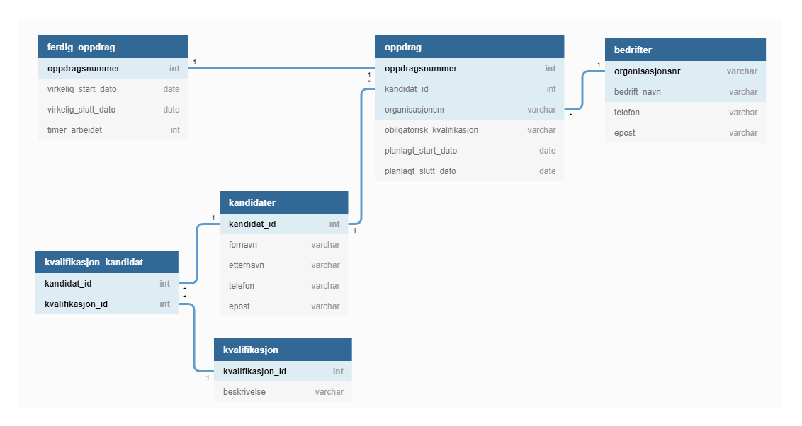

## Øving 6
# Fra tekstlig beskrivelse til SQL


## Oppgave a)


## Oppgave b)

```
bedrifter  (organisasjonsnr, bedrift_navn, telefon, epost)
            ﹉﹉﹉﹉﹉﹉﹉﹉﹉

kandidater (kandidat_id, fornavn, etternavn, telefon, epost)
            ﹉﹉﹉﹉﹉﹉﹉

kvalifikasjon (kvalifikasjon_id, beskrivelse)
               ﹉﹉﹉﹉﹉﹉﹉﹉﹉﹉

kvalifikasjon_kandidat (kandidat_id*, kvalifikasjon_id*)
                        ﹉﹉﹉﹉﹉﹉﹉﹉﹉﹉﹉﹉﹉﹉﹉﹉﹉﹉﹉

oppdarag (oppdaragsnummer, kandidat_id*, orginisasjonsnr*, kvalifikasjon_id*, 
          ﹉﹉﹉﹉﹉﹉﹉﹉﹉ 
         planlagt_start_dato, planlagt_slutt_dato
         
         )

ferdig_oppdrag (oppdragsnummer, virkelig_start_dato, virkelig_slutt_dato, timer_arbeidet)
                ﹉﹉﹉﹉﹉﹉﹉﹉﹉
```

## Oppgave c)

```sql
CREATE TABLE `kandidater` (
  `kandidat_id` int PRIMARY KEY NOT NULL AUTO_INCREMENT,
  `fornavn` varchar(255),
  `etternavn` varchar(255),
  `telefon` varchar(255),
  `epost` varchar(255)
);

CREATE TABLE `bedrifter` (
  `organisasjonsnr` varchar(255) PRIMARY KEY,
  `bedrift_navn` varchar(255),
  `telefon` varchar(255),
  `epost` varchar(255)
);

CREATE TABLE `kvalifikasjon_kandidat` (
  `kandidat_id` int,
  `kvalifikasjon_id` int,
  PRIMARY KEY (`kandidat_id`, `kvalifikasjon_id`)
);

CREATE TABLE `kvalifikasjon` (
  `kvalifikasjon_id` int PRIMARY KEY NOT NULL AUTO_INCREMENT,
  `beskrivelse` varchar(255)
);

CREATE TABLE `oppdrag` (
  `oppdragsnummer` int PRIMARY KEY,
  `kandidat_id` int,
  `organisasjonsnr` varchar(255),
  `obligatorisk_kvalifikasjon` varchar(255),
  `planlagt_start_dato` date,
  `planlagt_slutt_dato` date
);

CREATE TABLE `ferdig_oppdrag` (
  `oppdragsnummer` int PRIMARY KEY,
  `virkelig_start_dato` date,
  `virkelig_slutt_dato` date,
  `timer_arbeidet` int
);

ALTER TABLE `kvalifikasjon_kandidat` ADD FOREIGN KEY (`kandidat_id`) REFERENCES `kandidater` (`kandidat_id`);

ALTER TABLE `kvalifikasjon_kandidat` ADD FOREIGN KEY (`kvalifikasjon_id`) REFERENCES `kvalifikasjon` (`kvalifikasjon_id`);

ALTER TABLE `oppdrag` ADD FOREIGN KEY (`kandidat_id`) REFERENCES `kandidater` (`kandidat_id`);

ALTER TABLE `oppdrag` ADD FOREIGN KEY (`organisasjonsnr`) REFERENCES `bedrifter` (`organisasjonsnr`);

ALTER TABLE `ferdig_oppdrag` ADD FOREIGN KEY (`oppdragsnummer`) REFERENCES `oppdrag` (`oppdragsnummer`);
```


## Oppgave d)

### 1.
*Lag en liste over alle bedriftene. Navn, telefon og epost til bedriften skal skrives ut.*

```sql
SELECT * FROM `bedrifter`
```


### 2. 
*Lag en liste over alle oppdragene. Om hvert oppdrag skal du skrive ut oppdragets
nummer samt navn og telefonnummer til bedriften som tilbyr oppdraget.*

```sql
SELECT oppdrag.oppdragsnummer, bedrifter.bedrift_navn, bedrifter.telefon FROM `oppdrag`
join bedrifter on oppdrag.organisasjonsnr = bedrifter.organisasjonsnr
```

### 3. 
*Lag en liste over kandidater og kvalifikasjoner. Kandidatnavn og
kvalifikasjonsbeskrivelse skal med i utskriften i tillegg til løpenumrene som
identifiserer kandidat og kvalifikasjon.*

```sql
SELECT * FROM `kandidater`
JOIN kvalifikasjon_kandidat on kvalifikasjon_kandidat.kandidat_id = kandidater.kandidat_id
JOIN kvalifikasjon on kvalifikasjon.kvalifikasjon_id = kvalifikasjon_kandidat.kvalifikasjon_id
```

### 4. 
*Som oppgave 3d), men få med de kandidatene som ikke er registrert med
kvalifikasjoner.*


```sql
SELECT * FROM `kandidater`
left JOIN kvalifikasjon_kandidat on kvalifikasjon_kandidat.kandidat_id = kandidater.kandidat_id
left JOIN kvalifikasjon on kvalifikasjon.kvalifikasjon_id = kvalifikasjon_kandidat.kvalifikasjon_id
```

### 5. 
*Skriv ut jobbhistorikken til en bestemt vikar, gitt kandidatnr. Vikarnavn, sluttdato,
oppdragsnr og bedriftsnavn skal med.*

```sql
SELECT kandidater.kandidat_id ,CONCAT(kandidater.fornavn, " ",kandidater.etternavn) as Navn, ferdig_oppdrag.virkelig_slutt_dato ,oppdrag.oppdragsnummer, bedrifter.bedrift_navn FROM `kandidater`
left join oppdrag on oppdrag.kandidat_id = kandidater.kandidat_id
left join bedrifter on oppdrag.organisasjonsnr = bedrifter.organisasjonsnr
left join ferdig_oppdrag on oppdrag.oppdragsnummer = ferdig_oppdrag.oppdragsnummer
WHERE kandidater.kandidat_id = 2
```