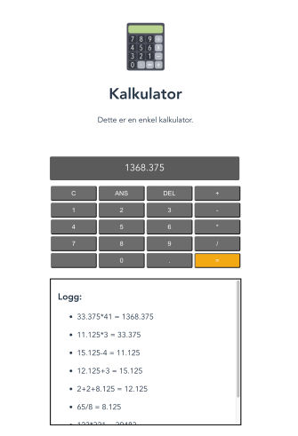
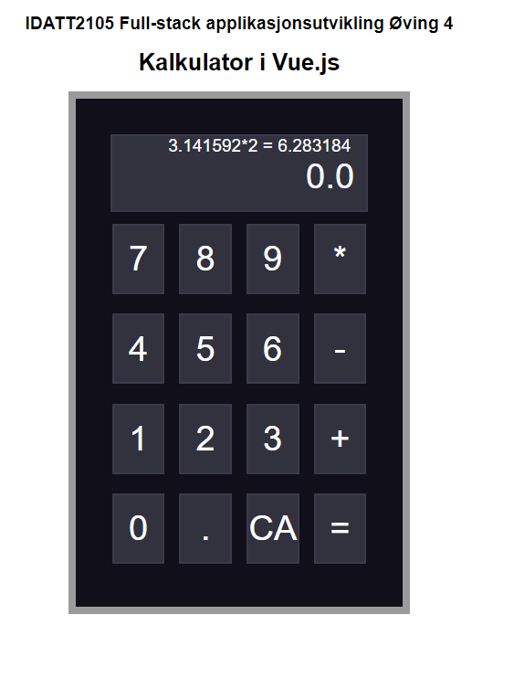
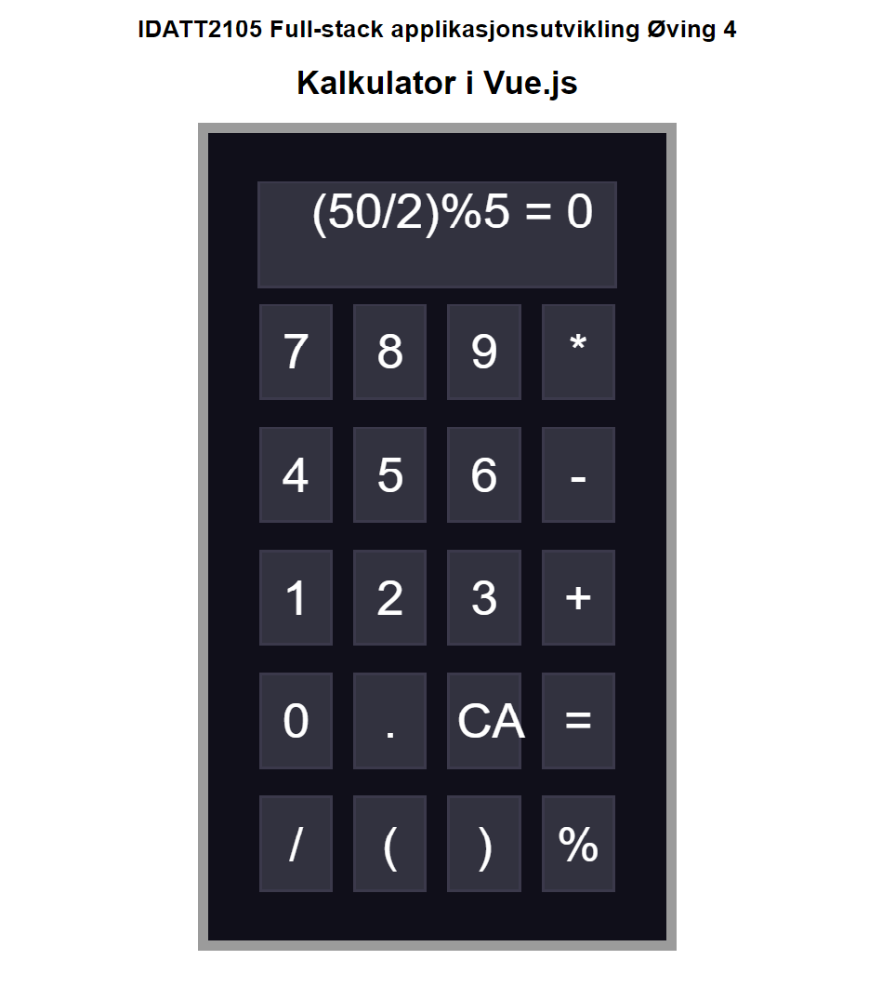

## IDATT2105 - Full-stack applikasjonsutvikling
# Øving 4 - : Kalkulator i Vue.js


## Oppgave
I denne øvingen ønsker vi at dere skal se på hvordan lage en kalkulator i Vue.js.
Dere skal altså lage et prosjekt med en enkelt side, der dere implementerer et
brukergrensesnitt for å utføre enkle
regnestykker. Et godt tips er å ta i bruk enten
CSS Grid eller Flexbox for formen på
kalkulatoren.

I tillegg til dette ønsker vi ha en logg over de
siste regnestykkene dere har utført. Dette
kan plasseres i for eksempel en collapsible
eller boks under kalkulatoren, men dere står
fritt til å lage det som for dere virker mest
hensiktsmessig. Liste over regnestykkene
skal oppdateres for hver kalkulasjon som
utføres. Et tips her er å se på conditional
rendering og state.

Vi ønsker gjerne at man implementerer en
enkel form for feilhåndtering, f.eks at man
ikke kan skrive inn bokstaver og ikke får feil
med komma. Dersom dere synes dette gikk
greit, kan en bonusoppgave være å se på
sidens responsivitet, altså hvordan den ser
ut på ulike skjermstørrelser, f.eks en mobil.
Dette er ingen krav, men kan være god
trening for videre arbeid.



## Løsning

## [Klikk her for demo](https://jesper-hustad.github.io/assignments/fs_2105/4/index.html)



## Forklaring

Jeg valgte å dele kalkulatoren inn i 2 vue components, en kalkulator og knapp.


## Button
I `button.vue` kan vi se hvordan knappen er programert.

Når knappen blir laget får den satt en `buttonValue`, denne variabelen blir da vist på kanppen og sendes til foreldrene med en `$emit()` funksjon når knappen trykkes. 

```html
<template>
  <div id="vuebutton">
      <button v-on:click="onClickButton" class="calc-element">
        {{ buttonValue }}
      </button>
  </div>
</template>

<script>

export default {
  name: 'vuebutton',
  props: { buttonValue: String },
  methods:{
      onClickButton () { this.$emit('clicked', this.$props.buttonValue) }
  }
}
</script>
```
## Calculator
Filen `calculator.vue` har kalkulatoren objektet. Denne har som jobb å lage knappene, ta imot knappe trykk, og vise kalkulert svar til brukeren.

For å generere knappene kan vi bruke Vue.js sin `v-for` med en array.

```html
<Button v-for="item in numbers" 
        v-bind:key=item
        v-bind:buttonValue=item
        @clicked='buttonClicked'>

</Button>

<script>
export default {
    components: { Button },
    data () {
        return {
            numbers: '7 8 9 * 4 5 6 - 1 2 3 + 0 . CA ='.split(' '),
            number: ''
        }
    }
...
```

For å få kalkulasjoner til å funke er det implementert noen enkle funksjoner for å håndtere logikken. Her bruker vi `this.number`, en "state" lagret i kalkulatoren.

```js
buttonClicked(character) {

    // Calculate answer and add result
    if(character == '=') {
        const result = eval(this.number)
        return this.addResult(this.number + ' = ' + result)
    }
    
    // Clear calculator
    if(character == 'CA'){
        this.addResult('')
        document.querySelector('.result-history').innerHTML = ""
        return
    }

    // Add button clicked to calculator
    this.number += character.toString()
    document.querySelector('.main-result').textContent = this.number

    // scroll history to bottom
    var scrollDiv = document.querySelector('.result');
    scrollDiv.scrollTop = scrollDiv.scrollHeight;
}
        
addResult(result){
    document.querySelector('.result-history').innerHTML += result + "<br>"
    document.querySelector('.main-result').textContent = ''
    this.number = ''
}
```

## Notat
I kalkulatoren er ikke alle funksjoner som man vanligvis finner i en kalkulator lagt til. Heldigvis er det enkelt med måten koden er implementert å legge til flere knapper.

Her kan vi se med å bare legge til: `/ ( ) %` på numbers listen så har vi lagt til deling, parantes, og modulo funksjonalitet.

```javascript
numbers: '7 8 9 * 4 5 6 - 1 2 3 + 0 . CA = / ( ) %'.split(' ')
```



## Setup

Nedlast prosjektet med git eller fra en zip fil [her](https://downgit.github.io/#/home?url=https://github.com/Jesper-Hustad/assignments/tree/master/fs_2105/4).

Etter du har gjort dine endringer til koden kan du kjøre programmet med komandoene:

```terminal
npm install
npm run dev

~ Project is running at http://localhost:8080/
```