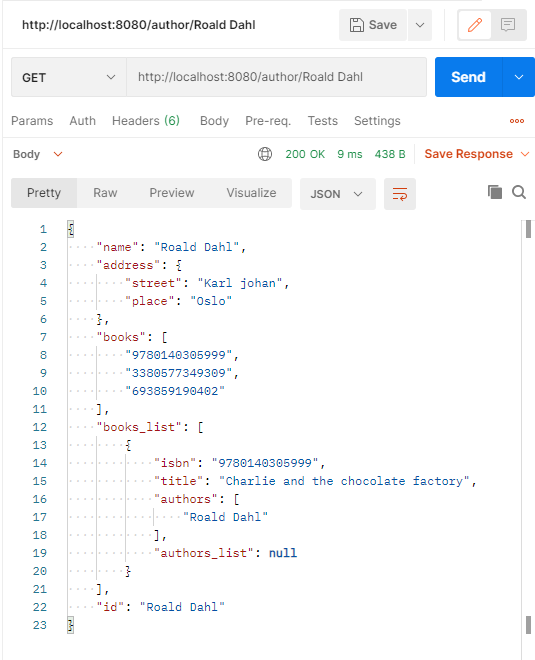

## IDATT2105 - Full-stack applikasjonsutvikling
# Øving 2 - REST API


### 1.
*Skriv klassene for bok og forfatter, med tillhørende klassevariabler du mener er fornuftig. En
forfatter kan ha skrevet flere bøker, og en bok kan være skrevet av flere forfattere. En forfatter
har en adresse (som også skal implementeres som egen klasse).*

Dette er hvordan jeg implementerte klassene:

```java
class Author { String name, Address address, ArrayList<Book> books }

class Book { String isbn, String title, ArrayList<Author> authors}

class Address { String street, String place }
```


### 2.
*Implementer metoder for å opprette, oppdatere, og slette forfattere og bøker i kontrolleren(e).
Merk her: ved å oppdatere en forfatter, har man også mulighet til å oppdatere hvilke bøker
forfatteren er knyttet til, og dette fremtvinger et lite spørsmål: dersom boka ikke eksisterer,
bør man da ha mulighet til å sende med informasjon om boka, slik at denne opprettes først
om den ikke eksisterer, og deretter knytter forfatteren til den? Hva sier prinsippene rundt
REST om dette? Hvordan er det med adressen til forfatteren?*

### Svar

REST prinsippene forteller oss at en request skall være "stateless", dette betyr at i et kall skal all informasjonen som trengs bli sent.

I vårt eksempell betyr det at serveren ikke skal trenge å sende en melding tilbake til klienten og si at boken ikke finnes i systemet. For å løse dette kan vi enten akseptere at en bok ikke er definert eller forvente at all informasjonen om en bok må gis i API kallet. Problemet med den andre løsningen er at det ikke finnes en grense på hvor mange ting som må defineres.

__Min løsning:__
```JSON
{
    "name" : "Roald Dahl",
    "bøker" : ["9780140305999", "3380577349309", "693859190402"],
    "adresse" : {
        "gate" : "Karl johan",
        "sted" : "Oslo",
    }
}

```


### 3.
*Implementer søk. Man skal kunne søke etter forfatter på navn. Man skal også kunne søke
etter bøker basert på navnet på boka, men i tillegg skal man kunne søke etter bøker basert
på forfatter. Hvordan blir dette i forhold til separering av klassene? Er det lurt å legge søket
etter bøker basert på forfatter, i «stacken» (beklager, fant ikke bedre ord) for bøker, når vi
allerede vet akkurat hvilke bøker som tilhører en forfatter? Er det andre måter å løse dette
på, som tillater å holde koden ren og ha god struktur?*
### Svar
Hvis man bruker navn på bøker og forfattere som id har man allerede lagd en søkemetode for disse slik oppgaven er definert

Det er raskere og enklere å finne forfatteren og fra der finne bøkene de har skrevet.Vi trenger da ikke å gå gjennom alle bøker som sparer tid. Løsning i koden:


```java
@GetMapping("/booksBy/{name}")
    public ArrayList<Book> booksBy(@PathVariable String name){
        Optional<Author> maybeAuthor = authorRead(name);

        if(maybeAuthor.isEmpty()) return new ArrayList<Book>();

        return maybeAuthor.get().getBooks_list();
    }

```


### 4.
*For hvert søk som gjøres, skal det også logges i servicen hvilket søk som ble gjort, og parameterene for dette søket. Bruk forskjellige logg-nivåer, for å få sjekket at det også fungerer.*

I service.properties kan vi skive slik og sette en logg level

```json
logging.level.no.ntnu.idatt2105.l4.demo.service.LibraryService=INFO
```

Her er utskriften i konsollen:

```JSON
2021-02-19 03:12:17.185  INFO 26884 --- [nio-8080-exec-1] n.n.i.l4.demo.web.LibraryController      : Creating author Roald Dahl
2021-02-19 03:12:23.829  INFO 26884 --- [nio-8080-exec-3] n.n.i.l4.demo.web.LibraryController      : Reading author Roald Dahl
```


## Eksempel av testing i postman

### Post author


### Post book


### Get author (med array av bøker)
