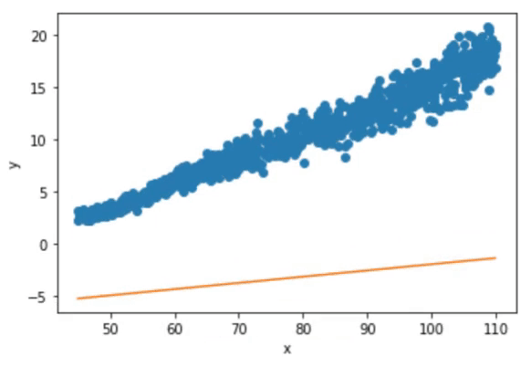

## IDATT2502 Anvendt maskinlæring med prosjekt
# Øving 1 - : Lineær regresjon

## Oppgave

Ta gjerne utgangspunkt i [linear-2d](https://gitlab.com/ntnu-tdat3025/regression/linear-2d).  
Datasettene i deloppgavene inneholder observasjoner om nyfødte barn. Det kan være
til hjelp å visualisere observasjonene først.  
**For alle deloppgavene:** du skal visualisere modellen etter optimalisering sammen
med observasjonene, og skrive ut tapsverdien (*loss*) for modellen.

Oppgave henter fra [her](assets/assignment).

## a) Lineær regresjon i 2 dimensjoner:

### Oppgave
Lag en lineær modell som predikerer vekt ut fra lengde gitt observasjonene i
[length_weight.csv](length_weight.csv)

### Løsning
Ved bruk av stochastic gradient descent i pytorch kan vi finne en optimal løsning på 130 epoker.
Trykk på bilde under for mer informasjon.

------
 
## b) Lineær regresjon i 3 dimensjoner:

### Oppgave
Lag en lineær modell som predikerer alder (i dager) ut fra lengde og vekt gitt
observasjonene i [day_length_weight.csv](day_length_weight.csv)

3D plotting kan være litt uvant, men se eksempler på matplotlib.org.

### Løsning

-----
## c) Ikke-lineær regresjon i 2 dimensjoner (se neste side):
- Lag en ikke-lineær modell som predikerer hodeomkrets ut fra alder (i dager) gitt
observasjonene i [day_head_circumference.csv](day_head_circumference.csv)
  - Bruk følgende modell prediktor: `f (x) = 20σ(xW + b) + 31`,  
    der σ er sigmoid funksjonen:  
    .

## Løsning

