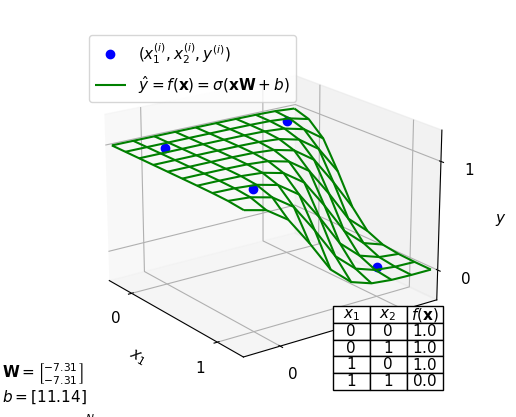

## IDATT2502 Anvendt maskinlæring med prosjekt
# Øving 2 - : Kunstlige nervale nettverk

## Oppgave

## a) NOT-operator modell:

### Oppgave
a) Lag en modell som predikerer tilsvarende NOT-operatoren.
Visualiser resultatet etter optimalisering av modellen.

### Løsning

```
W = -6.4774
b = 3.1307
loss = 0.0015
```

[](a.ipynb)  
Klikk bilde for python notebook

------
 
## b) NAND-operator modell:

### Oppgave
Lag en modell som predikerer tilsvarende NAND-operatoren.
Visualiser resultatet etter optimalisering av modellen.

### Løsning

```
W = [ -8.53 ]
    [ -8.53 ]
b = 3.80
loss = 0.01
```

[](nand-operator.py)  
Trykk bilde for å se koden


-----
## c) XOR-operator modell:

c) Lag en modell som predikerer tilsvarende XOR-operatoren. Før
du optimaliserer denne modellen må du initialisere
modellvariablene med tilfeldige tall for eksempel mellom -1 og 1. Visualiser både når optimaliseringen konvergerer og ikke
konvergerer mot en riktig modell.


### Løsning

Konvergerer mot en riktig modell:  
```
W1_init = [[-1.0, -1.0], [1.0, -1.0]]
b1_init = [[0.0, 0.0]]
W2_init = [[1.0], [1.0]]
b2_init = [[0.0]]
```

[](xor-operator.py)  


Konvergerer ikke mot en riktig modell.  
```
W1_init = [[1.0, 1.0], [1.0, 1.0]]
b1_init = [[0.0, 0.0]]
W2_init = [[1.0], [1.0]]
b2_init = [[0.0]]
```

[](xor-operator.py)  

Trykk bilde for å se koden.

## d) handskrevne tall modell:

### Oppgave

Lag en modell med prediktoren f (x) = softmax(xW + b) som
klassifiserer handskrevne tall. Se mnist for eksempel lasting av
MNIST datasettet, og visning og lagring av en observasjon. Du
skal oppnå en nøyaktighet på 0.9 eller over. Lag 10 .png bilder
som viser W etter optimalisering


### Løsning


-----


