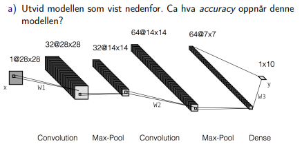

## IDATT2502 Anvendt maskinlæring med prosjekt
# Øving 3 - : Konvolusjonelle Nevrale Nettverk

Ta utgangspunkt i `nn.py` eller `nn_sequential.py` i [ntnu-tdat3025/cnn/mnist](https://gitlab.com/ntnu-tdat3025/cnn/mnist).
Kjør først dette eksempelet og se hva accuracy modellen oppnår.

```
Accuracy: 98.00%
```


## a) Enkel dense modell:

### Oppgave




### Løsning

[Kode](a.py)

```Python
nn.Sequential(
    nn.Conv2d(1, 32, kernel_size=5, padding=2), 
    nn.MaxPool2d(kernel_size=2), 
    nn.Conv2d(32, 64, kernel_size=5, padding=2),
    nn.MaxPool2d(kernel_size=2),
    nn.Flatten(), 
    nn.Linear(64 * 7 * 7, 10)
)
```

```
Accuracy: 98.59%
```

------

## b) Dobbelt dense modell:

### Oppgave


### Løsning

[Kode](b.py)

```Python
nn.Sequential(
    nn.Conv2d(1, 32, kernel_size=5, padding=2), 
    nn.MaxPool2d(kernel_size=2), 
    nn.Conv2d(32, 64, kernel_size=5, padding=2),
    nn.MaxPool2d(kernel_size=2),
    nn.Flatten(), 
    nn.Linear(64 * 7 * 7, 1024), 
    nn.Linear(1024, 10)
)
```

```
Accuracy: 98.16%
```

------

## c) Skreddersydd modell:

### Oppgave

Prøv selv og utvid modellen du laget i b). Hva *accuracy* klarer du å
oppnå?
- Prøv eksempelvis å legge til ReLU og/eller Dropout


### Løsning

[Kode](c.py)

```Python
nn.Sequential(
    nn.Conv2d(1, 32, kernel_size=5, padding=2), 
    nn.MaxPool2d(kernel_size=2),
    nn.Dropout(0.25), # added dropout
    nn.Conv2d(32, 64, kernel_size=5, padding=2), 
    nn.MaxPool2d(kernel_size=2),
    nn.Flatten(), 
    nn.Linear(64 * 7 * 7, 1024), 
    nn.Linear(1024, 10)
)
```

```
Accuracy: 97.72%
(best): 98.29%
```

------

## d) Fashion minst modell:

### Oppgave

I stedet for MNIST datasettet, bruk Fashion MNIST. Lag en passende
modell. Hva accuracy klarer du å oppnå?
- Fashion MNIST finnes i torchvision.datasets


### Løsning

[Kode](d.py)

```Python
# Fashion MNIST
torchvision.datasets.FashionMNIST('./data', train=True, download=True)
```

```
Accuracy: 89.50%
(best): 90.91%
```


------

 