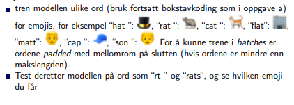

## IDATT2502 Anvendt maskinlæring med prosjekt
# Øving 4 - : Tilbakevendende Nevrale Nettverk


## a) Many to many LSTM:

### Oppgave

Ta utgangspunkt i [rnn/generate-characters](https://gitlab.com/ntnu-tdat3025/rnn/generate-characters) og tren modellen på
bokstavene “ hello world “. Bruk deretter modellen til å generere 50
bokstaver etter inputen “ h”.


### Løsning

[Kode](a.py)

```Python
char_encodings = [
    [1.0, 0.0, 0.0, 0.0, 0.0, 0.0, 0.0, 0.0], # ' '
    [0.0, 1.0, 0.0, 0.0, 0.0, 0.0, 0.0, 0.0], # 'h'
    [0.0, 0.0, 1.0, 0.0, 0.0, 0.0, 0.0, 0.0], # 'e'
    [0.0, 0.0, 0.0, 1.0, 0.0, 0.0, 0.0, 0.0], # 'l'
    [0.0, 0.0, 0.0, 0.0, 1.0, 0.0, 0.0, 0.0], # 'o'
    [0.0, 0.0, 0.0, 0.0, 0.0, 1.0, 0.0, 0.0], # 'w'
    [0.0, 0.0, 0.0, 0.0, 0.0, 0.0, 1.0, 0.0], # 'r'
    [0.0, 0.0, 0.0, 0.0, 0.0, 0.0, 0.0, 1.0], # 'd'
]

x_train = torch.tensor([
    [char_encodings[0]], # 
    [char_encodings[1]], # h
    [char_encodings[2]], # e
    [char_encodings[3]], # l
    [char_encodings[3]], # l
    [char_encodings[4]], # o
    [char_encodings[0]], # 
    [char_encodings[5]], # w
    [char_encodings[4]], # o
    [char_encodings[6]], # r
    [char_encodings[3]], # l
    [char_encodings[7]]  # d
])
```

```
hllloo
hllloworld    d
hlllo wolld   rld   rld   rld   rld   rld   rld   rl
hello world   rld   rrld   rld   rld   rrld   rld   
hello world  wrld  wrrdd  rrld  wrld  wrrld  wrld  w
hello world  wrld  wrld  wrrld world  wrld  wrld  wo
hello world  wrld  wrld  wrrld world  wrld  wrld  wo
hello world world  wrld  wrld  world world  wrld  wr
hello world world world world world world world worl
```

------

## b) Many to one LSTM:

### Oppgave




### Løsning

[Kode](b.py)

```Python
index_to_char = list(' hatrcflmpson')
index_to_emoji = ['🎩', '🐀', '🐱', '🏢', '🙃', '🧢', '👦']

# identity matrix
char_encodings = torch.eye(len(index_to_char)).numpy()
emoji_encodings = torch.eye(len(index_to_emoji)).numpy()

x_train = ...
y_train = ...

input_size = len(index_to_char)     # shape in
encoding_size = len(index_to_emoji) # shape out

model = LongShortTermMemoryModel(input_size, encoding_size)
```

```
ht🎩   rt🎩   rats🎩   atc🎩   flap🎩   flat🎩   cap🎩   son🎩   
ht🎩   rt🎩   rats🎩   atc🎩   flap🎩   flat🎩   cap🎩   son🎩   
ht🎩   rt🎩   rats🎩   atc🎩   flap🎩   flat🎩   cap🧢   son🎩   
ht🎩   rt🎩   rats🎩   atc🎩   flap🧢   flat🎩   cap🧢   son👦   
ht🎩   rt🎩   rats🎩   atc🎩   flap🧢   flat🏢   cap🧢   son👦   
ht🎩   rt🎩   rats🎩   atc🧢   flap🏢   flat🏢   cap🧢   son👦   
ht🎩   rt🐀   rats🐀   atc🧢   flap🏢   flat🏢   cap🧢   son👦   
ht🎩   rt🐀   rats🐀   atc🧢   flap🏢   flat🏢   cap🧢   son👦   
ht🎩   rt🐀   rats🐀   atc🐱   flap🏢   flat🏢   cap🧢   son👦   
ht🎩   rt🐀   rats🐀   atc🐱   flap🏢   flat🏢   cap🧢   son👦   
ht🎩   rt🐀   rats🐀   atc🐱   flap🏢   flat🏢   cap🧢   son👦   
ht🎩   rt🐀   rats🐀   atc🐀   flap🏢   flat🏢   cap🧢   son👦   
ht🎩   rt🐀   rats🐀   atc🐀   flap🏢   flat🏢   cap🧢   son👦
```

------