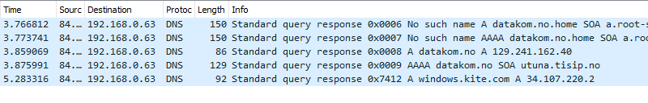

## IDATT2104 Datakommunikasjon 
# Øving 1 – m/ revidert TLS
 

## Oppgave 1: Wireshark og DNS (10%)

### a) 


### b)


```
> datakom.no
Server:  dnscache01.get.no
Address:  84.208.20.110
```

```
DNS Servers . . . . . . . . . . . : 84.208.20.110
```
Vi ser at adressene er identiske.
Vi ser at det er internett-leverandøren "GET" som har DNS serveren.

### c)

