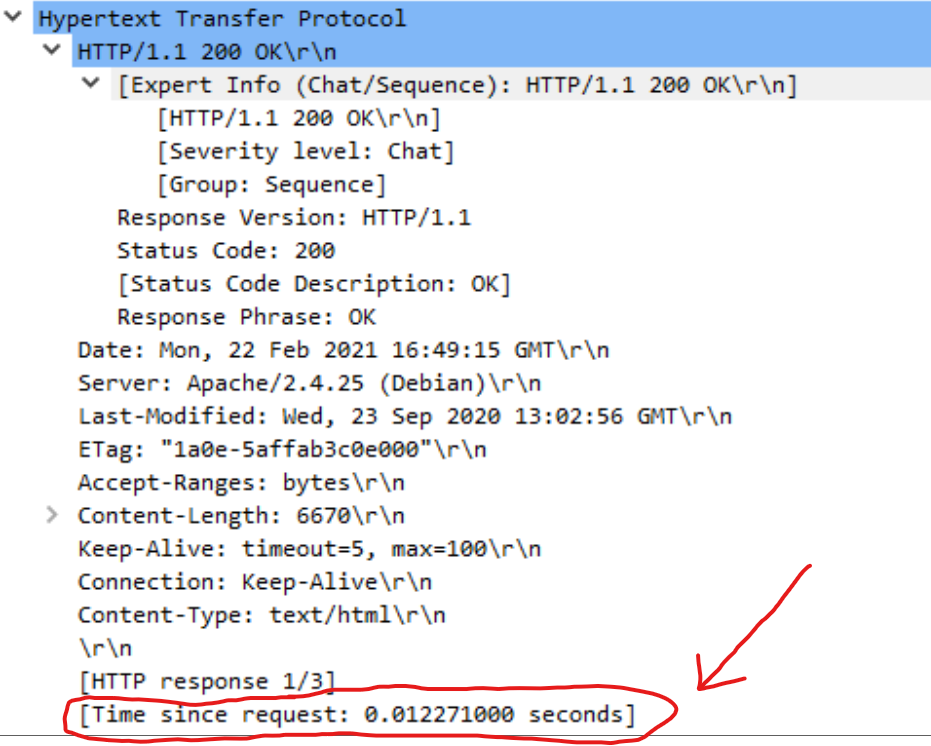
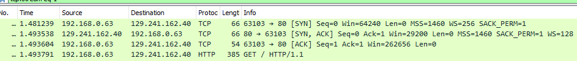
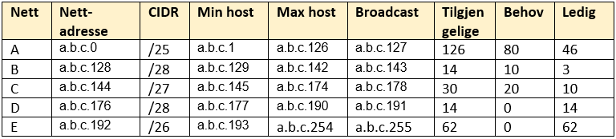

## IDATT2104 Datakommunikasjon 
# Øving 1 – m/ revidert TLS
 

## Oppgave 1: Wireshark og DNS (10%)

### a) 


Navnet er dnscache01.get.no ip adressen til den er 84.208.20.110. Svaret er at datakom.no finnes på 129.241.162.40

### b)


```
> datakom.no
Server:  dnscache01.get.no
Address:  84.208.20.110
```

```
DNS Servers . . . . . . . . . . . : 84.208.20.110
```
Vi ser at adressene er identiske.
Vi ser at det er internett-leverandøren "GET" som har DNS serveren. Dette er forventet.


### c)


TTL (Time to live) er 84171 sekunder og typen er A som er IPv4 adressen på nettverkslaget hvor websiden ligger.

TTL blir brukt for å vite når dataen skal slettes fra cache og type forteller oss at det er IPv4 dette handler om.


### d)


DNS har som oppgave å finne IP-adressen som et domenenavn er koblet til.
I infrastruktureren finnes det på toppnivå rottjenere til de lokale navnetjenere

Fra dette og de forrige oppgavene kan vi vite at dette er en lokal navntjener vi snakker med.

Domene er først ikke funnet i cachen til navntjeneren. 

En ROT blir sjekket for en IPv4 (A) og IPv6 (AAAA) type men ingenenting blir funnet der heller.

Deretter blir TOPP level tjener spurt og en IPv4 og IPv6 blir funnet.

## Oppgave 2: Wireshark og HTTP (15%)


### a)

Vi ser at det tar 0.01 sekunder (since last request) som er ganske raskt. Dette er fordi forbindelsen er vedvarende. Dette betyr at setup med å koble til igjen ikke trengs. (Det har også noe med at jeg har fiber også)


*Klient*  


*Tjener*  



### b)

Vi vet at denne forbindelsen er vedvarende fordi i headerne spør klienten om `Connection: keep-alive` og tjener svarer med `Keep-Alive: timeout=5, max=100`. Dette er hvor lenge forbindelsen holdes åpen før den lukkes. Hvis ingen data er sent eller motatt så lukkes forbindelsen. Med en timeout verdi på 5 betyr det at forbindelsen holdes åpen for 5 sekunder.


## Oppgave 3:Wireshark og TCP(20


### 3A. Oppkopling 3-way Handshak

| SRC   | -> | DST   | FLAGG    | SEQNR | ACKNR |
|-------|----|-------|----------|-------|-------|
| 63103 | -> | 80    | SYN      | 0     | 0     |
| 80    | -> | 63103 | SYN, ACK | 0     | 1     |
| 63103 | -> | 80    | ACK      | 1     | 1     |

Første byte for kvitteringnummer og sekvensnummer er 0




### 3B. Dataoverføring

Vi starter med en GET request til webtjeneren.
Etter dette ser vi at dataen er delt opp i PDUer (Protocol data unit) som sender data i flere deler. Til slutt får i et svar 200 med MIME typen `text/html` som er websiden. Etter dette ser nettleseren at en gif trengs i websiden og spør webtjeneren om dette. Vi får dataen sendt og et 200 svar 

*Tabell*  


*Skjermdump av wireshark*  


## Oppgave 4: Nettverksubnetting(20%)


Vi har 3 subnett med behov. Her brukes den nærmeste toerpotensen over behovet for å forsikre lavest mulige adresser benyttet. Resten fylles in slik at vi ender opp med alt brukt.



## Oppgave 5: Dokumentasjon av Programmeringsøving 1 – Tråder og socketprogrammering (15%)

### Øvingens Del 1:Enkel tjener/klient(kalkulator)

Dette er en litt forenklet versjon av programmene som viser hvordan de fungerer.

En forbindelse er satt opp. Mange forskjellige ting på settes opp og lukkes etterpå. I tjeneren brukes en socket slik at flere koblinger kan gjøres samtidig.

*Klient*
```java
/* Setter opp forbindelsen til tjenerprogrammet */
Socket forbindelse = new Socket(tjenermaskin, PORTNR);
System.out.println("Nå er forbindelsen opprettet.");

/* Åpner en forbindelse for kommunikasjon med tjenerprogrammet */
InputStreamReader leseforbindelse = new InputStreamReader(forbindelse.getInputStream());
BufferedReader leseren = new BufferedReader(leseforbindelse);
PrintWriter skriveren = new PrintWriter(forbindelse.getOutputStream(), true);

while (true) {
            
    // sender teksten til tjeneren
    skriveren.println(enLinje);  

    // mottar respons fra tjeneren
    String respons = leseren.readLine();

    // slutter program
    if(Objects.equals(respons, "EXIT")) break;
}

/* Lukker forbindelsen */
leseren.close();
skriveren.close();
forbindelse.close();
```

*Klient*
```java
ServerSocket tjener = new ServerSocket(PORTNR);

// venter inntil noen tar kontakt
Socket forbindelse = tjener.accept();

/* Lager en klient tråd og starter den */
Thread t = new KlientTraad(forbindelse);
t.start();

// ... I tråden:

/* Åpner strømmer for kommunikasjon med klientprogrammet */
InputStreamReader leseforbindelse = null;
leseforbindelse = new InputStreamReader(forbindelse.getInputStream());
BufferedReader leseren = new BufferedReader(leseforbindelse);
PrintWriter skriveren = null;
skriveren = new PrintWriter(forbindelse.getOutputStream(), true);

skriveren.println("Hvilken matematisk operasjon ønsker du å gjøre?");

/* Lukker forbindelsen */
leseren.close();
skriveren.close();
forbindelse.close();
```

### Meldingsinnholdet
Her har jeg brukt follow stream og vi kan se i klartekst informasjonen mellom klienten og tjeneren. De norske æøå vises ikke fordi wireshark viser dataen i  ASCII formatet.


### Øvingens Del 2:Enkel webtjener (returnere HTTP-header)

### a)


Når koblingen starter får vi to ACK i TCP 3-way handshake. Etter dette får vi ACK fra tjeneren etter GET meldingen og en ACK fra klienten når tjeneren svarer med 200

### b)

Nedkolbingen skjer når tjeneren lukker forbindelsenen. Koden under gjør dette etter dataen er sent.

```java
/* Sender HTML data til klienten */
skriveren.println(respons);

/* Lukker forbindelsen */
leseren.close();
skriveren.close();
forbindelse.close();
```


## Oppgave 6: Dokumentasjon av programmeringsøving 2 –UDP, TLS og ASIO(20%)

### Øvingens Del 1: Kalkulator med UDP


Buffer inneholder dataen som skal sendes.
```java
DatagramPacket sendPacket = new DatagramPacket(buffer, buffer.length, ip, SERVER_PORTNR);
datagramSocket.send(sendPacket);
```


Her ser vi fra perspektivet til tjeneren. Først deklareres portnr som tjeneren skal høre etter. Tjeneren må deretter vente på å motta en packet. Etter dette har skjedd kan bufferen dekodes til en string.
```java
DatagramSocket datagramSocket = new DatagramSocket(SERVER_PORTNR);

DatagramPacket mottaPacket = new DatagramPacket(buffer, buffer.length);

// venter inntil noen tar kontakt
datagramSocket.receive(mottaPacket);

String motattString = new String(buffer, 0, buffer.length);
```


Vi ser at det er bare 2 pakker, spørsmål og svar. Dette er i stor kontrast med TCP der vi har en SYN og FIN deler og en ACK etter hver melding.


Vi ser hvordan UDP bruker færre pakker og trenger mindre kode for å brukes imens TCP forsikrer at alle meldinger er motatt som er ganske nødvendig i mange situasjoner.  

## Øvingens Del 2: Etablere sikker kommunikasjon med TLS

### a)

Keys genereres med keytool som gir oss tjener og klient nøkler og sertifikater. Private nøklene lagres i en fil som også forteller litt om hva slags type nøkkel det er, med java så kan man bruke JKS formatet med det finnes mange format.


I koden bruker vi SSLSocketFactory 

```java
SSLSocketFactory sslSocketFactory = (SSLSocketFactory)SSLSocketFactory.getDefault();

Socket socket = sslSocketFactory.createSocket("localhost", port);
```
Når vi kjører programmet definerer vi hvor nøklene ligger

```
java 
  -Djavax.net.ssl.keystore="serverkeystore.jks" 
   -Djavax.net.ssl.keyStorePassword=password 
  JavaSSLServer 
```

```
java 
  -Djavax.net.ssl.trustStore=clienttruststore.jks 
  -Djavax.net.ssl.trustStorePassword=password
  JavaSSLClient
```

### b)

Klienten sender en klient hello og har 46 suites som kan velges mellom.


### c)

Her er ett eksempel på hvordan dette ser ut i wireshark. Man velger server hello packet og åpner opp Handshake protocol. Der finner man Cipher Suite.


### d)
`Issuer/commonname` og `subject/commonname` ble satt opp når sertifikate ble laget (for oss er dette med keytool).


### e)

Vi ser her at en server key exchange blir gjort. Etter dette sendes Change Cipher Spec packets som betyr at all komunikasjonen etter dette er kryptert med gitt metoder.

