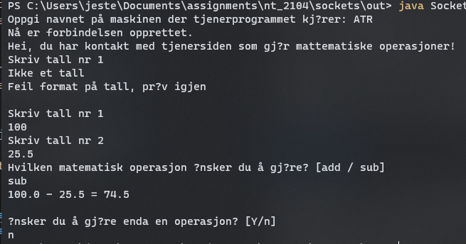
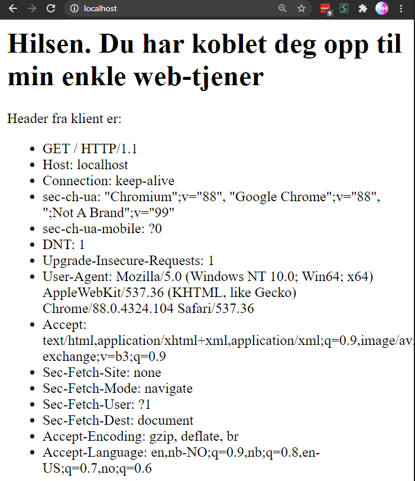

## Nettverksprogrammering Øving 1
# Socket, TCP og HTTP
 

## Oppgave 1 - Håndere flere klienter

Mye tatt fra eksempel koden, ønsket å ha en annen måte å stoppe programmet, implementerte dette med at når klienten får en spesiell kode fra tjeneren sluttes koblingen.

Klient tråd (KlientTraad) er en klasse som implementerer Thread klassen, ved å bruke `start()` metoden kan programmet på denne måten håndtere flere koblinger.

Om du skriver tallet feil eller prøver en mattematisk operasjon som ikke finnes i programmet får du en feilmelding og kan prøve igjen.

Tilslutt får du et valg om du ønsker å gjøre flere operasjoner, skriver du `Y` (yes) går programmet i en løkke slik at flere regnestykker kan gjøres, alt annet  slutter koblingen.

Her er utskriften fra kjøring av klient programmet i terminalen, når programmet spurte først etter tall nr 1 skrev jeg `Ikke et tall` og tjeneren ser at dette er feil format og spør brukeren om å skrive tallet på nytt. Fordi tallet i programmet er en double kan tall med desimaler brukes:

### [Tjener kode](./src/SocketTjener.java)
### [Klient kode](./src/SocketKlient.java)  

------

## Oppgave 2 - Lag en enkel web-tjener

I dette programmet er porten satt til 80 slik at det fungerer bra med nettleseren. Headers leses gjennom en `leseren.readline()` kodebit. deretter legges `<LI>  </LI>\n` på slik at det kan vises i HTML formatet i nettleseren.

Forbindelsen lukkes også når alt dette er ferdig fordi nettleseren viser ikke innholdetet før dette.

Her er en skjermdump av nettleseren som viser hva man får fra web tjeneren

### [WebTjener kode](./src/WebTjener.java)  

----

## Kjør instruksjoner
[Installer kompilert kode](https://downgit.github.io/#/home?url=https://github.com/Jesper-Hustad/assignments/tree/master/nt_2104/sockets/out) og unzip  
Åpne opp mappen i terminalen  
For webtjener oppgaven: `java WebTjener`  
For Socket programmene: `java SocketTjener` og `java SocketKlient`
