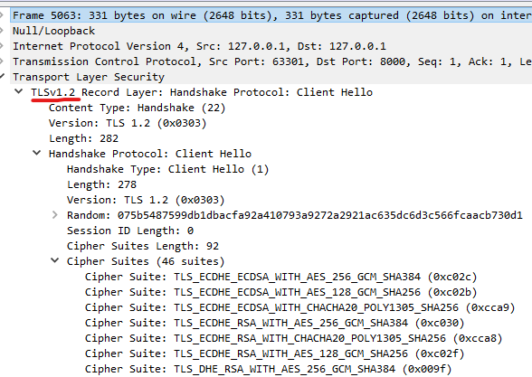

## Nettverksprogrammering Øving 2
# UDP, TLS og ASIO 
 

## Oppgave 1 - Kalkulator med UDP 


### Utskrift

Klient utskrift:

```json
Skriv tall operator tall | Eksempel: '5 + 2' | Skriv exit for å stoppe
> 3 + 4
Motatt: 7.0

Skriv tall operator tall | Eksempel: '5 + 2' | Skriv exit for å stoppe
> 20 - 9
Motatt: 11.0

Skriv tall operator tall | Eksempel: '5 + 2' | Skriv exit for å stoppe
> exit
Avslutter program
```

Tjener utskrift:
```json
Logg for tjenersiden. Nå venter vi...
Fikk en packet!
input er : 3 + 4
Fikk en packet!
input er : 20 - 9
Fikk en packet!
input er : exit
Slutter serveren
```

### Lenker

* [Klient Kode](./Oppg1/SocketKlient.java)  
* [Tjener Kode](./Oppg1/SocketTjener.java)

## Oppgave 2 - TLS/SSL 

Etter å ha satt opp java klassene og keys med keytool kjører vi serveren med 
```
java 
  -Djavax.net.ssl.keystore="serverkeystore.jks" 
   -Djavax.net.ssl.keyStorePassword=password 
  JavaSSLServer 
```
og klienten med

```
java 
  -Djavax.net.ssl.trustStore=clienttruststore.jks 
  -Djavax.net.ssl.trustStorePassword=password
  JavaSSLClient
```

For å se aktiviteten kan vi bruke Wireshark. Vi ser på loopback for lokal trafikk og filtrer på porten som brukes i programmet.


På wiki siden til Wireshark kan vi lære om hvordan å gjenkjenne SSL/TLS trafikk.


> Select the first TLS packet, labeled Client Hello.
Observe the packet details in the middle Wireshark packet details pane. Notice that it is an Ethernet II / Internet Protocol Version 4 / Transmission Control Protocol / Secure Sockets Layer frame. Also notice that the Ethernet II, Internet Protocol Version 4, and Transmission Control Protocol values are consistent with the TCP connection analyzed in Activity 3.

>Expand Secure Sockets Layer, TLS, and Handshake Protocol to view SSL/TLS details.
Observe the Cipher Suites and Extensions supported.
Observe the traffic captured in the top Wireshark packet list pane.

> Select the next packet, labeled TCP ACK. This is the server TCP acknowledgement of receiving the Client Hello request.

Vi kan se her på client hello at TLS blir brukt i en Handshake og lenger nede ser vi også Cipher suites tilgjengelig. 

