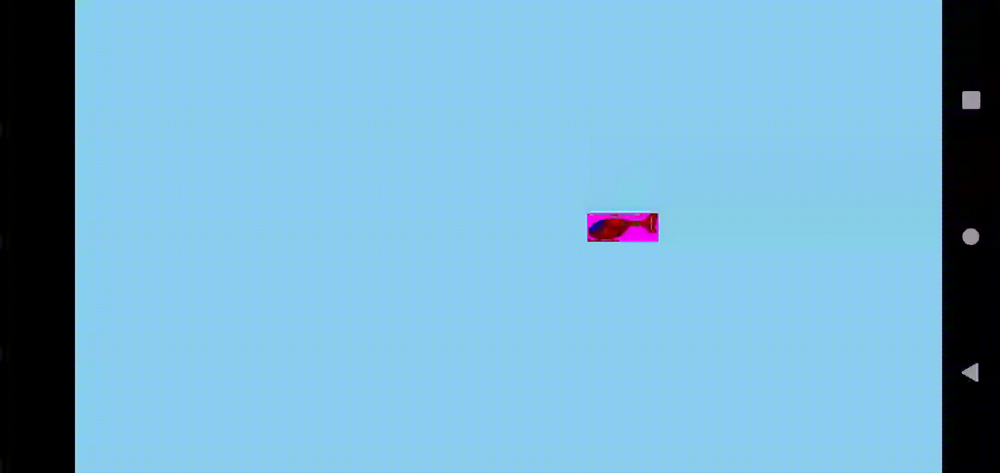
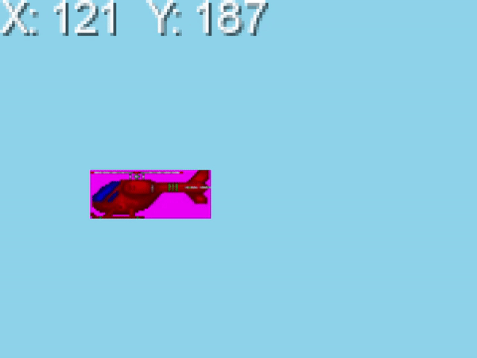
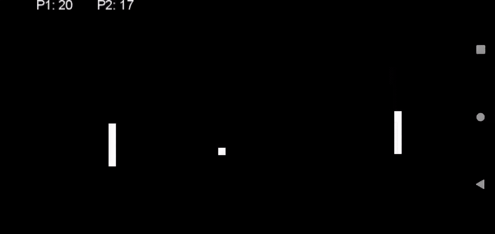

## TDT4240 Programvarearkitektur
# Pre-Project Exercise 1 

Included are the full android studio project folders for task 3 and 4.  
Zip folders includes the libgdx core code to run each task.  
Each task also has a libgdx .jar desktop version.

## Task 1  
Single helicopter that bounces off edges.  
  

## Task 2
Helicopter that follows touch input.  
  

## Task 3  
Animated helicopters with random speed and direction.  
Animation uses sprite sheet.  
React when hitting eachother.  
  

## Task 4
Pong game.  
P1 left player is controller by touch input.  
P2 right player is an AI.  
First to 21 wins.  

  